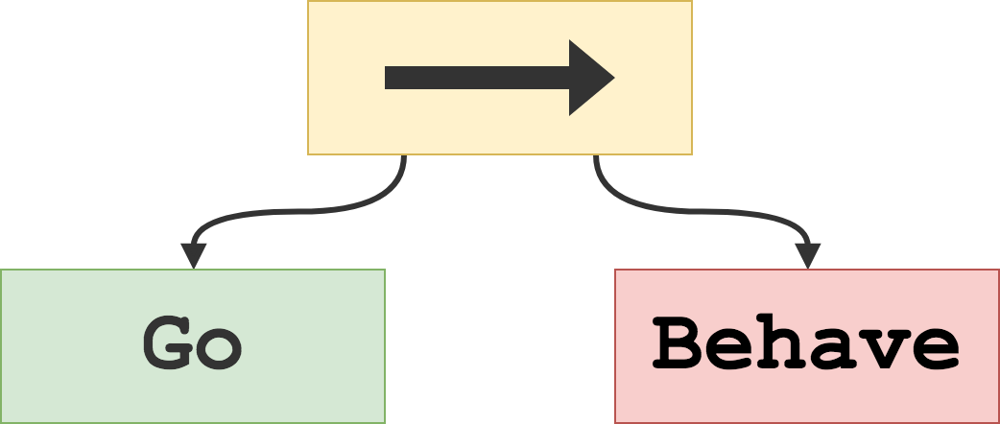

**<h1 align=center>Go Behave</h1>**

**<p align=center>An extensible Behavior Tree library in Go.</p>**

<p align="center">
<a href="https://godoc.org/github.com/AlexanderSkafte/go-behave"></a>
</p>

<p align=center>
    <a href="#introduction">Introduction</a> •
    <a href="#usage">Usage</a> •
    <a href="#installation">Installation</a> •
    <a href="#license">License</a>
</p>

<p align="center">
    
</p>

## Important notice

The library is still under development. Please do not assume API stability – fork the repository if you need that.

## <a id="introduction" style="text-decoration:none;color:inherit;">Introduction</a>

<!--<p align=center>
    <b><u><a href="#introduction">Introduction</a></u></b> •
    <a href="#usage">Usage</a> •
    <a href="#installation">Installation</a> •
    <a href="#license">License</a>
</p>-->

A behavior tree is a formalism for describing the behavior of an autonomous entity such as a robot or a non-player character in a video game. A behavior tree, by its nature, allows for highly modular behavior design thanks to the composability of its nodes, and the formalism makes task switching and state management trivial.

A behavior tree is a directed rooted tree with at most three categories of nodes: _composite nodes_, _decorator nodes_ and _leaf nodes_. Each category can contain many different _types_ of nodes. A _tick_ is sent from the root with a certain frequency, making a pre-order traversal of the tree. Each node type provides a different algorithm for processing the tick, explained below. Once a tick has been processed, the node returns a status to its parent - either _Failure_, _Running_ or _Success_.

Leaf nodes require a data context, which will be propagated throughout the tree via the `Tick` procedure. The context usually contains a reference to the owner of the tree, i.e. the entity for which the tree describes a behavior, and a _store_ or _blackboard_ which is a data storage system that can be shared between different entities - in a game this store would contain e.g. information about the game world, positions of all entities, and so on.

### Composite nodes

A composite node has a type and one or more children. Below are some common types of composite nodes:

- **Sequence**:
  Tick children in order. Succeeds only if each child succeeds. Fails as soon as any child fails. Returns Running if the currently executing child returns Running.
- **Selector**:
  Tick children in order. Succeeds as soon as a child succeeds. Fails only if each child fails. Returns Running if the currently executing child returns Running.
- **Random Sequence and Random Selector**:
  Same as sequence and selector, except the order of the children is randomized before each time the node runs.

### Decorator nodes

A decorator node has a type and one child. Below are some common types of decorator nodes.

- **Inverter**:
  The inverter node inverts (negates) the the result of its child, or returns Running if the child returns Running.
- **Repeater**:
  A repeater node will re-tick its child when it returns Success or Failure. The number of times the child is re-ticked can be limited or unlimited. Often used to wrap the root of the tree in order to make the tree run indefinitely.
- **Delayer**:
  A delayer node will always return Running during a certain amount of time, after which it tick its child and return its status.

### Leaf nodes

A leaf node, also called execution node, action node or task node, is normally specifically tailored to the application at hand. In a robotics context the task might be "Pick Up Object" or "Move Arm"; in a video game context it might be "Find Nearest Target" or "Attack Target".

A leaf node can also be a _condition node_ which returns Success or Failure depending on whether some condition is fulfilled in the environment.

## <a id="usage" style="text-decoration:none;color:inherit;">Usage</a>

<!--<p align=center>
    <a href="#introduction">Introduction</a> •
    <b><u><a href="#usage">Usage</a></u></b> •
    <a href="#installation">Installation</a> •
    <a href="#license">License</a>
</p>-->

Please see the [documentation](https://godoc.org/github.com/AlexanderSkafte/go-behave) and the [examples](examples).

### Defining custom nodes

While the library offers a set of pre-made common node types, it's easy to implement your own. The available node types can be found in the `composite`, `decorator` and `action` packages. These are _not_ required for you to use the rest of the library, but greatly simplify usage.

In order to define a custom node type, the type must embed `*core.T` where `T` is either `Composite`, `Decorator` or `Action`, and define the following methods:

```go
(n *YourCustomNode) Start(*core.Context)
(n *YourCustomNode) Tick(*core.Context) core.Status
(n *YourCustomNode) Stop(*core.Context)
```

The struct may also contain other fields that will be initialized in the node's _constructor_, which you also need to create. If you intend to construct a tree containing the node by compiling a definition string (see the next section), the function type of the custom node's constructor function must match one of `CompositeFn`, `DecoratorFn` or `ActionFn` (see [core/types.go](core/types.go)). An example can be seen in [common/decorator/repeater.go](common/decorator/repeater.go) (or any other type in the `composite`, `decorator` or `action` packages).

### Defining behavior

A behavior tree describing a specific behavior can be built in one of two ways: either by compiling a definition string written in GBL ("Go Behave Language") or by defining a tree directly in Go code.

#### Using GBL to define a behavior tree

Please see [examples/behave](examples/behave) for examples.

Defining a behavior tree in GBL requires pre-registration of nodes to be used via a `*gbl.Registry` handle in order for the parser to recognize them. The [behave](behave.go) package provides a `CommonNodeRegistry` function that will return a registry with available common nodes registered.

**TODO**: Make a document outlining the GBL specification.

#### Using Go to define a behavior tree

Please see [examples/behave](examples/behave) for examples.

### Creating behavior tree instances

An instance of a `BehaviorTree` type can be created by passing a `Config` object to the `NewBehaviorTree` function. Config has two fields - `Owner` and `Data`, both of type `interface{}`. How you choose to use these fields is up to you. Commonly, `Owner` refers to the entity to which the behavior tree is attached, and `Data` refers to some kind of storage mechanism, such as a `Blackboard` (e.g. ([store/Blackboard.go](store/blackboard.go))) or any structure of your choice. The types of `Owner` and `Data` will of course have to be asserted inside the application specific nodes at runtime.

## <a id="installation" style="text-decoration:none;color:inherit;">Installation</a>

<!--<p align=center>
    <a href="#introduction">Introduction</a> •
    <a href="#usage">Usage</a> •
    <b><u><a href="#installation">Installation</a></u></b> •
    <a href="#license">License</a>
</p>-->

`go get github.com/alexanderskafte/go-behave`

The package is identified by `behave`, not `go-behave`.

## <a id="license" style="text-decoration:none;color:inherit;">License</a>

<!--<p align=center>
    <a href="#introduction">Introduction</a> •
    <a href="#usage">Usage</a> •
    <a href="#installation">Installation</a> •
    <b><u><a href="#license">License</a></u></b>
</p>-->

This project is licensed under the MIT License - see the [LICENSE.txt](LICENSE.txt) file for details.
